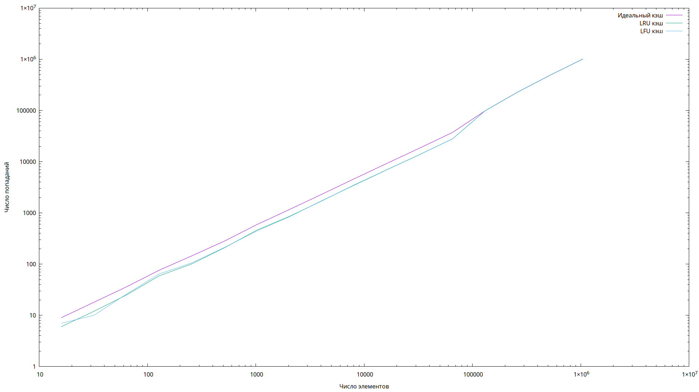

# Description

This is my implementation of some caching alhorithms for Vladimirov c++ course

# Buildng

To build simply run `make`

# Testing

To generate tests run `make generate_tests`

To run tests run `make test`

To make plot run `plot.pgi` after running tests

# Some results

Large cache (cache size) = (number of elements) / 4

Small cache (cache size) = (number of elements) / 16
